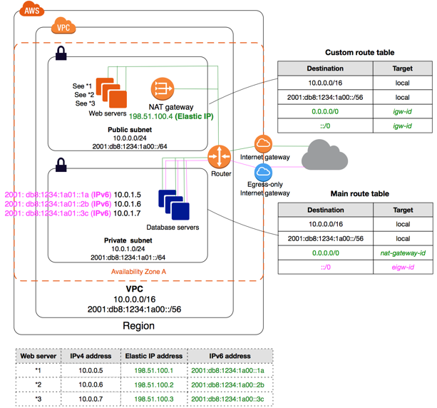
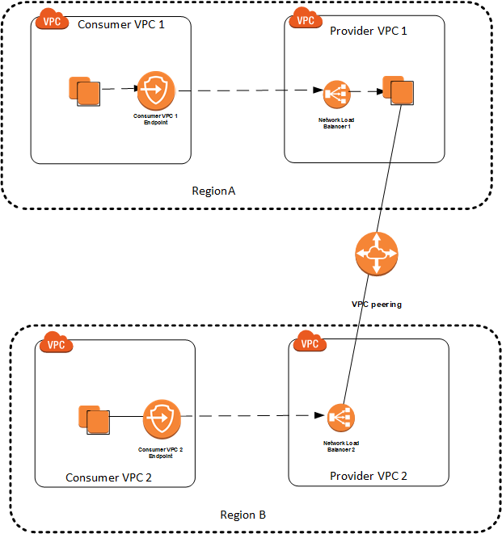

# AWS Cheat Sheet

## S3

* **Object** based storage (files)
* Files can be from **0 Bytes & 5 TB**
* Bucket web address: `https://s3-<AZ name>.amazonaws.com/<bucketname>` e.g. `https://s3-eu-west-1.amazonaws.com/myuniquename`
* Bucket name has to be **unique** across all regions
* **Read after write** consistency for PUTs of new objects
* **Eventual** consistency for overwrite PUTs and DELETEs
* **Designed for** 99.99% availability for S3 Standard, 99.9% for S3 - IA & 99.5% for S3 One Zone - IA
* Amazon **guarantees availability** - 99.9% for S3 Standard, 99% for S3 - IA & S3 One Zone - IA
* Amazon **guarantees durability** of 99.999999999% (11 * 9's) for all storage classes
* **Replicated** to >= 3 AZ (except S3 One Zone IA)
* **S3 Standard** - Frequently accessed
* **S3 Infrequently Accessed (IA)** - Provides rapid access when needed
* **S3 Infrequently Accessed (IA)** - Less storage cost but has data retrieval cost
* **S3 One Zone IA** - Data is stored in a single AZ + Retrieval charge
* **S3 Intelligent Tiering** - ML based - moves object to different storage classes based on its learning about usage of the object
* **S3 Glacier** - Archive + Retrival time configurable from minutes to hours + Retrieval charge (Separate service integrated with S3)
* **S3 Glacier Deep Archive** - Retrieval time of 12 hrs + Retrieval charge
* **S3 Reduced Redundacy** - Deprecated. Sustains loss of data in a single facility
* Minimum storage period
  * Intelligent Tiering - 30 days
  * Standard IA - 30 days
  * One Zone IA - 30 days
  * Glacier - 90 days
  * Glacier Deep Archive - 180 days
* Charged based on 
  * Storage
  * No. of Requests
  * Storage Management (Tiers)
  * Data Transfer
  * Transfer Acceleration
  * Cross Region Replication
* **Cross Region Replication** for High Availability or Disaster Recovery
* **Cross Region Replication** requires versioning to be enabled in both source and destination
* **Cross Region Replication** is not going to replicate
  * file versions created before enabling cross region replication
  * delete marker
  * version deletions
* **Cross Region Replication** is asynchronous
* **Cross Region Replication** can replicate to buckets in different account
* **Transfer Acceleration** for reduced upload time
* **Transfer Acceleration** takes advantage of Cloudfront's globally distributed edge locations and then routes data to the S3 bucket through Amazon's internal backbone network
* The **bucket access logs** can be stored in another bucket which must be owned by the same AWS account in the same region
* Enabling **logging** on a bucket from the management console also updates the ACL on the target bucket to grant write permission to the Log Delivery group
* **Encryption at Rest** - 
  * SSE-S3 (Amazon manages key)
  * SSE-KMS (Amazon + User manages keys)
  * SSE-C (User manages keys)
  * Client Side Encryption (User manages keys and encrypt objects)
* **SSE-S3**
  * Server side encryption
  * Key managed by S3
  * AES 256
  * Must set header - **`"x-amz-server-side-encryption":"AES256"`**
* **SSE-KMS**
  * Server side encryption
  * Key managed by KMS
  * More control on rotation of key
  * Audit trail on how the key is used
  * Must set header - **`"x-amz-server-side-encryption":"aws:kms"`**
* **SSE-C**
  * Server side encryption
  * Key managed by customer outside AWS
  * HTTPS is a must
  * Key to be supplied in HTTP header of every request
* **Client Side Encryption**
  * Key managed by customer outside AWS
  * Clients encrypt / decrypt data
* When **encryption** is enabled on an existing file, a new version will be created (provided versioning is enabled)
* Prefer default **encryption** settings over S3 bucket policies to encrypt objects at rest
* With **SSE-KMS** enabled, the KMS limits might need to be increased to avoid throttling of a lot of small uploads
* **Versioning**, once enabled, cannot be disabled. It can only be suspended
* **Versioning** is enabled at the bucket level
* If **versioning** is enabled, S3 can be configured to require multifactor authentication for 
  * permanently deleting an object version
  * suspend versioning on bucket
* Only root account can enable **MFA Delete** using CLI
* In a bucket with **versioning** enabled, even if the file is deleted, the bucket cannot be deleted using AWS CLI until all the versions are deleted
* When each individual file is given public access separately, uploading a new version of an existing file doesn't automatically give **public access** to the latest version (unless an S3 bucket policy exists to give public access)
* **Lifecycle management rules** (movement to different storage type and expiration) can be set for current version and previous versions separately
* **Lifecycle management rules** can be used to delete incomplete multipart uploads after a configurable no. of days
* Files are stored as **key-value pair**. Key is the file name with the entire path and value is the file content as a sequence of bytes
* More than 5 GB files must be uploaded using **multipart upload**
* Files larger than 100 MB should be uploaded using **multipart upload**
* **Multipart upload** advantages -
  * Retry is faster
  * Run in parallel to improve performance and utilize network bandwidth
* There can be at most 10 tags
* S3 **Bucket Policy** can be used to enforce upload of only encrypted objects. The policy will deny any PUT request that does not have the appropriate header
* S3 **Bucket Policy** can be used to provide public read access to all files in the bucket instead of providing public access to each individual file
* S3 evaluates and applies **bucket policies** before applying bucket encryption settings. Even if bucket encryption settings is enabled, PUT requests without encryption information will be rejected if there are bucket policies to reject such PUT requests
* S3 static website URL: `<bucket-name>.s3-website-<aws-region>.amazonaws.com` or `<bucket-name>.s3-website.<aws-region>.amazonaws.com`
* **Pre-signed URL** allows users to get temporary access to buckets and objects
* **S3 Inventory** allows producing reports about S3 objects daily or weekly in a different S3 bucket
* **S3 Inventory** reports format can be specified and the data can be queried using Athena
* **Storage class** needs to be specified during object upload
* **S3 Analytics**, when enabled, generates reports in a different S3 bucket to give insights about the object usage and this can be used to recommend when the object should be moved from one storage class to another
* **Glacier** - Retrieval Policy
  * Expedited (1 - 5 mins retrieval)
  * Standard (3 - 5 hours)
  * Bulk (5 - 12 hours)
* **Glacier** - object == archive (upto 40 TB)
* **Glacier** - bucket == vault
* **Glacier** - Each vault has ONE vault policy & ONE lock policy
  * **Vault Policy** - similar to bucket policy - restrict user access
  * **Lock Policy** - immutable - once set cannot be changed
    * WORM Policy - write once read many
    * Forbid deleting an archive if it is less than 1 year = regulatory compliance
    * Nultifactor authentication on file access
* Files retrieved from **Glacier** will be stored in Reduced Redundancy Storage class for a specified number of days
* For faster retrieval from **Glacier** based on Retrieval Policy, Capacity Units may need to be purchased
* Amazon S3 **Glacier** automatically encrypts data at rest using Advanced Encryption Standard (AES) 256-bit symmetric keys
* **Glacier** range retrieval (byte range) is charged as per the volume of data retrieved
* In a single **Glacier** upload, an archive of maximum 4GB size can be uploaded
* Any **Glacier** upload above 100 MB  should use multipart upload
* A **Glacier** vault can be deleted only when all its content archives are deleted
* **Glacier** allows the user or application to be notified through SNS when the requested data becomes available
* Bucket access policy (for S3) or Vault access policy (for Glacier) are resource based policies (directly attached to a particular resource - vault/bucket in this case), whereas IAM policies are user based policies
* One Vault access policy can be attached to each Vault
* One **Glacier** retrieval policy per region
* **S3 Glacier Select** - 
  * Allows to select a subset of rows and colums using SQL without retrieving the entire file
  * Joins and subqueries not allowed
  * Files can be compressed with GZIP or BZIP2
  * Works with file format CSV, JSON, Parquet
  * Works with all 3 retrieval options - Expedited, Standard & Bulk
* **Glacier** inventory (of available objects) is updated every 24 hours - no real time data
* Earlier S3 **performance** would start degrading with 100 TPS
* Historically the recommended approach is to have **random 4 characters** in front of the key name for better distribution of objects across partitions
* To host a static website the S3 bucket will have the same name as the domain or subdomain
* S3 notification feature enables the user to receive notifications when certain events happen in a bucket. S3 supports following destinations
  * Amazon SNS
  * Amazon SQS
  * AWS Lambda
* Supports at least 3,500 requests per second to add data and 5,500 requests per second to retrieve
* Server access logging provides detailed records for the requests that are made to a bucket

## Cloudfront

* Content Delivery Network (CDN)
* **Cache content** at edge location
* Popular with S3, but also works with **EC2 & Load Balancer**
* Supports **RTMP (media)** protocol
* **Reduced latency** and reduced load on server
* **Origin Access Identity (OAI)** is an user used by Cloudfront to access the S3 files
* **S3 bucket policy** gives access to OAI and thus preventing users from directly accessing the S3 files bypassing the Cloudfront
* Cloudfront **accesslogs** can be stored in an S3 bucket
* To serve the media of a WordPress website from Cloudfront use the Apache .htaccess file to rewrite the URLs
* Supports **SNI** (Server Name Indication). This allows Cloudfront distributions to support multiple TLS certificates
* The data transfer out of CloudFront is not chargeable
* **Invalidation requests** to remove something from the cache is chargeable
* CloudFront supports **Field Level Encryption**, so that the sensitive data can only be decrypted and viewed by certain components or services in the application stack
* To use **Field Level Ecryption**, the specific fields and encryption public key need to be configured in CloudFront
* Use signed URLs for the following cases:
  * RTMP distribution. Signed cookies aren't supported for RTMP distributions.
  * Restrict access to individual files, for example, an installation download for your application.
  * Users are using a client (for example, a custom HTTP client) that doesn't support cookies.
* Use signed cookies for the following cases:
  * Provide access to multiple restricted files, for example, all of the files for a video in HLS format or all of the files in the subscribers' area of a website
  * You don't want to change your current URLs
* You can configure CloudFront to create log files that contain detailed information about every user request that CloudFront receives
* If you enable logging, you can also specify the Amazon S3 bucket that you want CloudFront to save files in

## Snowball

* If it takes **more than a week** to transfer data over the network, prefer Snowball
* **Snowball Edges** have computational capabilities
  * <= 100 TB
  * Can be **Storage Optimized (24 vCPU)** or **Compute Optimized (52 vCPU) & optional GPU**
  * Allows processing **on the go**
  * Useful for IoT capture, machine learning, data migration, image collation etc.
* An 80 TB Snowball appliance and 100 TB Snowball Edge appliance only have 72 TB and 83 TB of usable capacity respectively

## Snowmobile

* 100 PB in capacity
* Better than snowball if data to be transferred is more than 10 PB

## Storage Gateway

* Storage Gateway supports **hybrid cloud** by allowing the on-primise resources access the cloud storage like EBS, S3 etc. through standard protocols
* Storage Gateway **types** - 
  * File Gateway
  * Volume Gateway
  * Tape Gateway
* **File Gateway** - 
  * Configured S3 buckets accessible through **NFS & SMB** protocol
  * Bucket access using IAM roles for each File Gateway
  * Most recently used data is **cached** in File Gateway
  * Can be **mounted** on many servers
* **Volume Gateway** - 
  * Block storage using **iSCSI protocol** backed by S3
  * **EBS snapshots** stored **S3** buckets
  * **Cached Volume** - Recently used data cached
  * **Stored Volume** - Entire dataset in premise with scheduled backups in S3
* **Tape Gateway** - 
  * Backup from on premise **tape to S3 Glacier** using **iSCSI protocol**
* By default, Storage Gateway uses Amazon S3-Managed Encryption Keys (SSE-S3) to server-side encrypt all data it stores in Amazon S3

## Athena

* **Serverless** service
* Allows to do analytics directly on **S3**
* Supports **data formats** CSV, JSON, ORC, Avro, Parquet (built on Presto)
* Uses **SQL** to query the files
* **Good for** analyzing VPC Flow Logs, ELB Logs etc.

## IAM

* **Global** service
* **Users** for individuals
* **User Groups** for grouping users with similar permission requirements
* **Roles** are for machines or internal AWS resources. One IAM Role for ONE application

## EC2

* **Security Groups** are for network security
* **Security group**s are locked down to a region / VPC combination
* **Security Groups** can refer to other Security Groups
* One **security group** can be attached to multiple EC2 instances
* Multiple **security groups** can be assigned to a single EC2 instance
* If connection to application times out, it could be a **security group** issue. If connection is refused, it's an application issue
* **Security Group** - All inbound traffic is blocked by default
* **Security Group** - All outbound traffic is authorized by default
* **Security Groups** are stateful - if the inbound traffic on a port is allowed, outbound traffic on the same port is automatically allowed
* Change in **security group** takes effect immediately
* **Security groups** cannot blacklist an IP or port. Everything is blocked by default, we need to specifically open ports
* **Elastic IP** gives a fixed IP to an EC2 instance across restarts
* By default one AWS account can have 5 **elastic IP**
* Prefer load balancer over **Elastic IP**
* EC2 **User Data** script runs once (with root privileges) at the instance first start
* EC2 Launch types - 
  * **On-demand instances** - short workload, predictable pricing
  * **Reserved instances** - long workload (>= 1 year)
  * **Convertible reserved instances** - long workload with flexible instance types
  * **Scheduled reserved instances** - reserved for specific time window
  * **Spot instances** - short workload, cheap, can lose instances, good for batch jobs, big data analytics etc.
  * **Dedicated instances** - no other customer will share the hardware, but instances from same AWS account can share hardware, no control on instance placement
  * **Dedicated hosts** - the entire server is reserved, provides more control on instance placement, more visibility into sockets and cores, good for "bring your own licenses", complicated regulatory needs
* **Billing** by second with a minimum of 60 seconds
* A custom **AMI** can be created with pre-installed software packages, security patches etc. instead of writing user data scripts, so that the boot time is less during autoscaling
* **AMIs** are built for a specific region, but can be copied across regions
* T2/T3 are **burstable** instances. Spikes are handled using burst credits that are accumulated over time. If burst credits are all consumed, performance will suffer
* **M instance types** are balanced
* `http://169.254.169.254/latest/user-data/` gives **user data** scripts
* `http://169.254.169.254/latest/meta-data/` gives **meta data**
* `http://169.254.169.254/latest/meta-data/public-ipv4/` gives **public IP**
* `http://169.254.169.254/latest/meta-data/local-ipv4/` gives **local IP**
* Two types of **placement groups**
  * **Clustered Placement Group** - Grouping of instances within a single AZ. Recommended for applications that need low network latency and high network throughput. Only certain instances can be launched in this placement group. It cannot spac multiple AZ
  * **Spread Placement Group** - Instances are placed in distinct hardware. Recommended for applications that have a small number of critical instances that should be kept separate from each other. It can span multiple AZ
* The instances within a **placement group** should be homogeneous
* Existing instances can't be moved into a **placement group**
* **Placement groups** can't be merged
* AWS AMI Virtualization types - 
  * Paravirtual (PV)
  * Hardware Virtual Machine (HVM) - Amazon recommends
* Instance store backed EC2 instances can only be rebooted and terminated. They cannot be stopped unlike EBS-backed instances
* EBS-backed instances once stopped, all data in any attached instance-stores will be deleted
* EC2-Classic is the original version of EC2 where the elastic IP would get disassociated when the instance stopped
* With EC2-VPC, the Elastic IP does not get disassociated when stopped
* When EC2 instance is stopped, it may get moved to a different underlying host
* EC2 instance states that are billed
  * running
  * stopping (The instannce is preparing to hibernate - NOT when the instance is being stopped)
  * terminated (for reserved instances only that are still in their contracted term)
* AWS Systems Manager Parameter Store provides secure, hierarchical storage for configuration data management and secrets management. You can store data such as passwords, database strings, and license codes as parameter values. You can store values as plain text or encrypted data. You can then reference values by using the unique name that you specified when you created the parameter
* Select Auto-assign Public IP option so that the launched EC2 instance has a public IP from Amazon's public IP pool
* All AMIs are categorized as either backed by Amazon EBS or backed by instance store
* To coordinate Availability Zones across accounts, you must use the AZ ID, which is a unique and consistent identifier for an Availability Zone
* Using the console, you can change the DeleteOnTermination attribute when you launch an instance. To change this attribute for a running instance, you must use the command line
* With instance store, the entire image is downloaded from S3 before booting and hence the boot time is usually around 5 mins
* With EBS-backed instances, only the part needed for booting is first downloaded from the EBS Snapshot and hence the boot time is shorter around 1 min
* When an Amazon EBS-backed instance is stopped, you're not charged for instance usage; however, you're still charged for volume storage
* We charge you for each second, with a one-minute minimum, that you keep the instance running, even if the instance remains idle and you don't connect to it
* AMIs with encrypted volumes cannot be made public. It can be shared with specific accounts along with the KMS CMK
* During the AMI-creation process, Amazon EC2 creates snapshots of your instance's root volume and any other EBS volumes attached to your instance. You're charged for the snapshots until you deregister the AMI and delete the snapshots
* If any volumes attached to the instance are encrypted, the new AMI only launches successfully on instances that support Amazon EBS encryption
* Encrypting during the CopyImage action applies only to Amazon EBS-backed AMIs. Because an instance store-backed AMI does not rely on snapshots, you cannot use copying to change its encryption status
* **Spot Price** - If you terminate your instance, you pay for any partial hour used (as you do for On-Demand or Reserved Instances). However, you are not charged for any partial hour of usage if the Spot price goes above your maximum price and Amazon EC2 interrupts your Spot Instance
* **Hypervisors** - Xen, Nitro

## EFS

* Supports Network File System version 4 (**NFSv4**)
* **Read after write** consistency
* Data is stored across **multiple AZ's** within a region
* **No pre-provisioning** required
* To use EFS
  * install **amazon-efs-utils**
  * **mount** the EFS at the appropriate location

## ELB
  
* **ELB types** - 
  * **Classic Load Balancer** (V1 - old generation) - Lower cost than ALB, but less flexibility
  * **Application Load Balancer** (V2 - new generation) - Layer 7 - application aware
  * **Network Load Balancer** (V2 - new generation) - Layer 4 - extreme performance
* ELB provides **health check** for instances
* **ALB** can handle **multiple applications** where each application has a traget group and load for that application is balanced across instances within the particular target group
* **ALB** supports HTTP/HTTPS & Websocket protocols
* **ALB** - True IP, port and protocol details of the client are inserted in HTTP headers - X-Forwarded-For, X-Forwarded-Port and X-Forwarded-Proto respectively
* **ALB** can route based on hostname in URL and route in URL
* **ALB** supports SNI (Server Name Indication). This allows ALB to support multiple TLS certificates
* **Network Load Balancers** are mostly used for extreme performance and should not be the default load balancer
* **Network Load Balancers** have less latency ~100 ms (vs 400 ms for ALB)
* Load Balancers have **static host name**. DO NOT resolve & use underlying IP
* LBs can scale but not instantaneously – contact AWS for a “warm-up”
* ELBs do not have a predefined IPv4 address. We resolve to them using a **DNS name**
* **504 error** means the gateway has timed out and it is an application issue and NOT a load balancer issue
* **Sticky session** - required if the ec2 instance is writing a file to the local disk. Traffic will not go to other ec2 instances for the session
* **Cross zone load balancing** - If one AZ does not receive any traffic
* **Path Patterns** - Allows to route traffic based on the URL patterns
* The VPC and subnets need to be specified during configuration
* Elastic Load Balancing provides access logs that capture detailed information about requests sent to your load balancer
* Elastic Load Balancing captures the logs and stores them in the Amazon S3 bucket that you specify as compressed files
* Each access log file is automatically encrypted before it is stored in your S3 bucket and decrypted when you access it

## Auto Scaling Group

* Auto scaling group is configured to register new instances to a traget group of **ELB**
* **IAM role** attached to the ASG will get assigned to the instances
* If instance gets **terminated**, ASG will restart it
* If instance is marked as **unhealthy** by load balancer, ASG will restart it
* ASG can scale based on **CloudWatch alarms**
* ASG can scale based on **custom metric** sent by applications to CloudWatch
* If all subnets in different **availability zones** are selected, the ASG will distribute the instances across multiple AZ
* During the configured warm up period the EC2 instance will not contribute to the **auto scaling metrics**
* **Scaling out** is increasing the number of instances and **scaling up** is increasing the resources
* The cooldown period helps to ensure that the Auto Scaling group doesn't launch or terminate additional instances before the previous scaling activity takes effect
* The default cooldown period is 300 seconds
* Cooldown period is applicable only for simple scaling policy
* Launch Configuration specifies the properties of the launched EC2 instances such as AMI etc.
* Launch configuration cannot be changed once created
* Scaling Policy - 
  * Target tracking scaling — Increase or decrease the current capacity of the group based on a target value for a specific metric. E.g. CPU Utilization or any other metric that will increase or decrease proportionally with the no. of instances
  * Step scaling — Increase or decrease the current capacity of the group based on a set of scaling adjustments, known as step adjustments, that vary based on the size of the alarm breach. The configuration defines the desired number of instances for a range of value for the given metric. There could be multiple such steps defined
  * Simple scaling — Increase or decrease the current capacity of the group based on a single scaling adjustment
* When there are multiple policies in force at the same time, there's a chance that each policy could instruct the Auto Scaling group to scale out (or in) at the same time. When these situations occur, Amazon EC2 Auto Scaling chooses the policy that provides the largest capacity for both scale out and scale in
* Default termination policy - 
  * Determine which Availability Zone(s) have the most instances, and at least one instance that is not protected from scale in
  * Determine which instance to terminate so as to align the remaining instances to the allocation strategy for the On-Demand or Spot Instance that is terminating and your current selection of instance types
  * Determine whether any of the instances use the oldest launch template
  * Determine whether any of the instances use the oldest launch configuration
  * Instances are closest to the next billing hour

## EBS

* An EBS volume is a **network drive**
* An EC2 machine by default loses its **root volume** when terminated
* It's locked to an **AZ**. To move a volume to a different AZ, a snapshot needs to be created
* EBS Volume types:
  * **General Purposse SSD (GP2)** - General purpose SSD volume
  * **Provisioned IOPS SSD (IO1)** - Highest-performance SSD volume for mission-critical low-latency or high throughput workloads. Good for Databases.
  * **Throughput Optimized HDD (ST1)** - Low cost HDD volume designed for **frequently accessed**, throughput intensive workloads. Good for big data and datawarehouses
  * **Cold HDD (SC1)** - Lowest cost HDD volume designed for **less frequently** accessed workloads. Good for file servers
  * **EBS Magnetic HDD (Standard)** - Previous generation HDD. For workloads where data is infrequently accessed
* io1 can be provisioned from 100 IOPS up to 64,000 IOPS per volume on Nitro system instance families and up to 32,000 on other instance families. The maximum ratio of provisioned IOPS to requested volume size (in GiB) is 50:1. Therefore, with a 10 Gib volume, the maximum provisioned IOPS should be 500
* **RAID 0**
  * Striping in multiple disk volumes
  * When I/O performance is more important than fault tolerance
  * Loss of a single volume results in complete data loss
* **RAID 1**
  * When fault tolerance is more important than I/O performance
  * Even in the absence of RAID 1, EBS is already replicated within AZ
* **Max IOPS/Volume**
  * io1 - 64,000 (based on 16K I/O size)
  * gp2 - 16,000 (based on 16K I/O size)
  * st1 - 500 (based on 1 MB I/O size)
  * sc1 - 250 (based on 1 MB I/O size)
* SSD is good for short random access. HDD is good for heavy sequential access
* SSD provides high IOPS (np. of read-write per second). HDD provides high throughput (no. of bits read/written per second)
* The size and IOPS (**only for IO1**) can be increased
* Increasing the size or the volume does not automatically increase the **size of the partition**
* EBS volumes can be backed up using **snapshots**
* **Snapshots** are also used to resizing a volume down, changing the volume type and encrypting a volume
* **Snapshots** occupy only the size of data
* **Snapshots** exist on S3
* **Snapshots** are incremental
* You can share your unencrypted **snapshots** with specific AWS accounts, or you can share them with the entire AWS community by making them public
* You can share an encrypted **snapshot** only with specific AWS accounts. For others to use your shared, encrypted snapshot, you must also share the CMK key that was used to encrypt it
* **Snapshots** of encrypted volumes are always encrypted
* Volumes restored from encrypted **snapshots** are encrypted automatically
* To take a **snapshot** of the root device, the instance needs to be stopped
* Copying an unencrypted **snapshot** allows encryption
* EBS **Encryption** leverages keys from KMS (AES-256)
* All the data in flight moving between the instance and an encrypted volume is **encrypted**
* Encryption of a root volume involves following steps, 
  * Take a **snapshot**
  * Copy the **snapshot** and choose the ecryption option (Once encrypted, it cannot be uncrypted by again making a copy)
  * Create an Image (**AMI**) from the encrypted snapshot
* EBS **backups** use IO and hence backups should be taken during off-peak hours
* Each EBS volume is automatically **replicated** within its own AZ to protect from component failure and provide high availability and durability
* EC2 instance and its volume are going to be in the same **AZ**
* Migrating EBS to a different **AZ or Region** involves the following steps
  * Create a **snapshot**
  * Create an **AMI**
  * Copy the **AMI** to a different Region
  * Launch an **EC2 instance** in a different Region with the AMI
* The **size and type** of the EBS volumes can be changed without even stopping the EC2 instance
* **AMI** can be created directly from the volume as well
* **AMI** root device storage can be
  * Instance Store (Ephemeral Stores)
  * EBS Backed Volumes
* **Instance store** volumes are created from a template stored in Amazon S3
* **Instance stores** are attached to the host where the EC2 is running, whereas EBS volumes are network volumes. However, in 90% of the use cases the difference in latency with the two types of stores does not make any difference
* Throughput = IOPS * I/O size. The I/O size is 256KB (earlier 16KB). If the IOPS provisioned is 500, the instance can achieve 500 * 256KB writes per second
* EBS Optimized Instances - With small additional fee, customers can launch certain Amazon EC2 instance types as EBS-optimized instances. EBS-optimized instances enable EC2 instances to fully use the IOPS provisioned on an EBS volume. Contention between Amazon EBS I/O and other traffic from the EC2 instance is minimized
* Amazon Data Lifecycle Manager (Amazon DLM) automates the creation, deletion and retention of EBS snapshots
* Improving I/O performance
  - Use RAID 0
  - Increase size of EC2 instance
  - Use appropriate volume types
  - Enhanced Networking feature can provide higher I/O performance and lower CPU utilization to the EC2 instance. However, HVM AMI instead of PV AMI is required
* EBS can provide the lowest latency store to a single EC2 instance. EBS latency is lesser than S3 even with VPC endpoint
* You can configure your AWS account to enforce the encryption of your EBS volumes and snapshots. Activating encryption by default has two effects:
  * AWS encrypts new EBS volumes on launch
  * AWS encrypts new copies of unencrypted snapshots
* Encryption by default is a Region-specific setting. If you enable it for a Region, you cannot disable it for individual volumes or snapshots in that Region
* Newly created EBS resources are encrypted by your account's default customer master key (CMK) unless you specify a customer managed CMK in the EC2 settings or at launch
* EBS encrypts your volume with a data key using the industry-standard AES-256 algorithm. Your data key is stored on-disk with your encrypted data, but not before EBS encrypts it with your CMK; it never appears on disk in plaintext
* When you have access to both an encrypted and unencrypted volume, you can freely transfer data between them. EC2 carries out the encryption and decryption operations transparently
* To create snapshots for Amazon EBS volumes that are configured in a RAID array, there must be no data I/O to or from the EBS volumes that comprise the RAID array. These same precautions and steps should be followed whenever you create a snapshot of an EBS volume that serves as the root device for an EC2 instance

## CloudWatch

* CloudWatch is for monitoring performance, whereas **CloudTrail** is for auditing API calls
* CloudWatch with EC2 will monitor events every 5 min by default. With **detailed monitoring**, the interval will be 1 min
* CloudWatch alarms can be created to trigger notifications
* Enabling CloudWatch logs for **EC2**
  * Assign appropriate CloudWatch access policy to the IAM role
  * Install CloudWatch agent (awslogsd) in EC2
* Since AWS does not have access to the  underlying OS, some metrics are **missing** including disk and memory utilization
* CloudWatch can collect metrics and logs from services, resources and applications on AWS as well on-premise services
* CloudWatch Alarms can be created to 
  * send SNS notifications
  * do EC2 autoscaling when a certain metrics satisfies a configured condition
  * do EC2 actions
    * Recover - Recover the instance on different hardware
    * Stop
    * Terminate
    * Reboot
* CloudWatch Events allow the user to configure a Lambda function to be triggered on certain system events
* CloudWatch Alarms 
  * impaired - checks failed
  * insufficient data - checks in progress 
  * ok - all checks passed
* Amazon CloudWatch does not aggregate data across Regions. Therefore, metrics are completely separate between Regions

## CloudTrail

* By default CloudTrail keeps account activity details upto 90 days
* These events are limited to management events with create, modify, and delete API calls and account activity. For a complete record of account activity, including all management events, data events, and read-only activity, you’ll need to configure a CloudTrail trail
* By setting up a CloudTrail trail you can deliver your CloudTrail events to Amazon S3, Amazon CloudWatch Logs, and Amazon CloudWatch Events
* You can create up to five trails in an AWS region. A trail that applies to all regions exists in each region and is counted as one trail in each region
* By default, CloudTrail log files are encrypted using S3 Server Side Encryption (SSE) and placed into your S3 bucket
* CloudTrail integration with CloudWatch logs enables you to receive SNS notifications of account activity captured by CloudTrail. For example, you can create CloudWatch alarms to monitor API calls that create, modify and delete Security Groups and Network ACL’s

## CloudFormation

* AWS CloudFormation templates are JSON or YAML-formatted text files that are comprised of five types of elements:
  * An optional list of template parameters (input values supplied at stack creation time)
  * An optional list of output values (e.g. the complete URL to a web application)
  * An optional list of data tables used to lookup static configuration values (e.g., AMI names)
  * The list of AWS resources and their configuration values
  * A template file format version number

## Route 53
  
* In AWS, the most common records are:
  * **A**: URL to IPv4
  * **AAAA**: URL to IPv6
  * **CNAME**: URL to URL
  * **Alias**: URL to AWS resource.
* Prefer **Alias** over CNAME for AWS resources (for performance reasons)
* Route53 has advanced features such as:
  * **Load balancing** (through DNS – also called client load balancing)
  * **Health checks** (although limited…)
  * **Routing policy**: simple, failover, geolocation, geoproximity, latency, weighted, multivalue answer
* IPv4 - 32 bit, IPv6 - 128 bit
* **Simple Routing** - Multiple IP addresses against a single A record. Route 53 returs all of them in random order
* **Wighted Routing** - A separate A record for each IP with a percentage weight. A separate health check can be associated with each IP or A record. SNS notification can be sent if a health check fails. If a health check fails, the server is removed from Route 53, until the health check passes
* **Latency Based Routing** - A separate A record for each IP with a percentage weight. A separate health check can be associated with each IP or A record. Routing happens to the server with lowest latency
* **Failover Routing** - 2 separate A records - one for primary and one for secondary. Health check can be associated with each, If primary goes down, traffic will all be ruted to secondary
* **Geolocation Based Routing** - A separate A record for each IP. Each A record is mapped to a location and the routing happens to a specific server depending on which location the DNS query originated. Good for scenarios where different website will have different language laels based on location
* **Multivalue Answer** - Simple routing with health checks of each IP
* **Geoproximity** - Must use Route 53 Traffic Flow. Routes traffic based on geographic location of users and resources. This can be further influenced with biases

## RDS

* Upto 5 **Read Replicas** (Async Replication - within AZ, cross AZ or cross Region)
* **Read replicas** of read replicas are possible
* Each **read replica** will have its own DNS endpoint
* **Read replica** can be created in a separate region as well
* If a **read replica** is promoted to its own database, the replication will stop
* **Read replica** cannot be enabled unless the automatic backups are also enabled
* **Read replicas** themselves can be **Multi-AZ*** for disaster recovery
* A failover in a **Multi-AZ** deployment can be forced by rebooting the DB
* Two ways of improving performance
  * Read replicas
  * ElasticCache
* **Replication** for Disaster Recovery is synchronous (across AZ - Automatic failover - DNS endpoint remains same) - Multi AZ
* **Replicas** can be promoted to their own DB
* Automated **backups**:
  * Daily full snapshot of the database
  * Capture transaction logs in real time
  * Ability to restore to any point in time
  * 7 days retention (can be increased to 35 days)
* The **backup** data is stored in S3
* Backups are taken during specified window. The application may experience elavated latency during **backup**
* Restoring DB from automatic **backup** or snapshots always creates a new RDS instance with a new DNS endpoint
* DB Snapshots:
  * Manually triggered by the user
  * Retention of backup for as long as we want
* Encryption at rest capability with AWS KMS - AES-256 encryption
* To enforce SSL:
  * PostgreSQL: rds.force_ssl=1 in the AWS RDS Console (Paratemer Groups)
  * MySQL: Within the DB: GRANT USAGE ON *.* TO 'mysqluser'@'%' REQUIRE SSL;
* To connect using SSL:
  * Provide the SSL Trust certificate (can be download from AWS)
  * Provide SSL options when connecting to database
* RDS, in general, is **not serverless** (except Aurora Serverless which is serverless)
* We cannot access the RDS **virtual machines**. Patching the RDS operating system is Amazon's responsibility
* **Enhanced Monitoring** metrics are useful when it is required to see how different processes or threads on a DB instance use the CPU

## DynamoDB

* Supports both **document and key-value** data model
* Stored on **SSD storage**
* **Spread across** 3 geographically distributed data centers
* Supports both **Eventual Consistant** Reads (Default) & **Strongly Consistant** Reads
* **Serverless** service
* Amazon DynamoDB Accelerator (DAX) is a fully managed, highly available, in-memory cache that can reduce Amazon DynamoDB response times from milliseconds to microseconds
* 

## Redshift

* Amazon's **data warehouse** solution
* Single node (160 GB) or multi node (leader node and compute node - upto 128 compute nodes)
* **Column based** data store, column based compression techniques and multiple other compression techniques
* No indexes or materialized views
* Massively **parallel processing**
* Redshift attempts to maintain **3 copies** of data (the original and replica on the compute nodes and a backup in S3)
* Available in only **1 AZ**
* **Backup** retention period is 1 day by default which can be extended to 35 days
* Can asynchronously replicate to S3 in a different region for **disaster recovery**
* **Redshift Spectrum** is a feature of Amazon Redshift that enables you to run queries against exabytes of unstructured data in Amazon S3, with no loading or ETL required
* With **enhanced VPC Routing**, Amazon Redshift forces all COPY and UNLOAD traffic between the Redshift cluster and the data repositories through the Amazon VPC. When we use Enhanced VPC Routing to route traffic through your VPC, you can also use VPC flow logs to monitor COPY and UNLOAD traffic.
* Amazon Redshift logs information about connections and user activities in your database. These logs help you to monitor the database for security and troubleshooting purposes, which is a process often referred to as database auditing. The logs are stored in the Amazon Simple Storage Service (Amazon S3) buckets
  * Connection log — logs authentication attempts, and connections and disconnections
  * User log — logs information about changes to database user definitions
  * User activity log — logs each query before it is run on the database
* work load management

## Aurora

* Aurora **storage** automatically grows in increments of 10GB, up to 64 TB
* Aurora can have 15 **replicas** while MySQL has 5, and the replication process is faster (sub 10 ms replica lag)
* 2 copies of data is maintained in each **AZ** with a minimum of 3 AZ
* Compute resources can scale upto 32 vCPUs and 244 GB of memory
* Aurora can transparently handle the loss of 2 copies of data without affecting write availability and 3 copies of data without affecting read availability
* **Backups** and snapshots does not impact database performance
* Storage is self-healing. Disks and blocks are scanned for errors and repaired automatically
* Aurora snapshots can be shared with other AWS accounts
* Two types of **replicas** - MySQL replicas (based on MySQL binlog) and Aurora Replicas
* Automated **failover** is only possible with Aurora replicas (not MySQL replicas)
* **Failover** in Aurora is instantaneous. It’s HA native
* If you have an Amazon Aurora Replica, in the same or a different Availability Zone, when failing over, Aurora flips the canonical name record (CNAME) for your DB Instance to point at the healthy replica, which is in turn promoted to become the new primary. Start-to-finish, failover typically completes within 30 seconds
* If you are running Aurora Serverless and the DB instance or AZ become unavailable, Aurora will automatically recreate the DB instance in a different AZ
* If you do not have an Amazon Aurora Replica (i.e. single instance) and are not running Aurora Serverless, Aurora will attempt to create a new DB Instance in the same Availability Zone as the original instance
* Disaster recovery across regions is a manual process, where you promote a secondary region to take read/write workloads
* Aurora Endpoints - 
  * Cluster Endpoint - Primary DB for read-write
  * Reader Endpoint - load balanced read replicas for reading
  * Custom endpoint - load balanced groups of read replicas (max 5 custom endpoints)
* The amount of replication is independent of the number of DB instances in your cluster
* The Aurora shared storage architecture makes your data independent from the DB instances in the cluster. For example, you can add a DB instance quickly because Aurora doesn't make a new copy of the table data. Instead, the DB instance connects to the shared volume that already contains all your data

## ElasticCache

* ElastiCache is to get managed Redis or Memcached
* ElasticCache features - 
  * Write Scaling using **sharding**
  * Read Scaling using **Read Replicas**
  * **Multi AZ** with Failover Capability
* Redis - Multi AZ, **Backups and restore**
* Memcached - Multi threaded, horizontal scaling
* Elastic cache can be used as - **db cache**, **session store**
* Caching patterns - 
  * Write through
  * Lazy loading
  
## VPC

* **VPC Architecture Diagram**

* **VPC Architecture Diagram with IPV6**

* VPC **Flow Logs** allows us to monitor the traffic within, in and out of your VPC (useful for security, performance, audit)
* VPC are per Account per **Region**
* Subnets are per VPC per **AZ**
* Subnet doesn't span across **AZ**
* Inter AZ data transfer is chargeable
* You are initially limited to launching 20 Amazon EC2 instances per Region at any one time and a maximum VPC size of /16 (65,536 IPs)
* An instance launched in a VPC using an Amazon EBS-backed AMI maintains the same IP address when stopped and restarted
* **Security Groups** doesn't span across VPC
* A VPC can have only 1 **internet Gateway**
* Amazon reserves 5 **IP** in each subnet - 4 at the begining & 1 at the end
* Each EC2 instance performs source/destination checks by default. This means that the instance must be the source or destination of any traffic it sends or receives. However, a **NAT** instance must be able to send and receive traffic when the source or destination is not itself. Therefore, we must disable source/destination checks on the NAT instance
* **NAT** instace / gateway must be in public subnet
* A route from private subnet to **NAT** Gateway is important
* **NAT** instance must have a security group
* **NAT** Gateway is redundant inside an AZ
* **NAT** Gateway starts at 5 Gbps and scales upto 45 Gbps
* **NAT** Gateway don't need a security group
* **NAT** Gateway automatically have a public IP assigned
* With **NAT** Gateway there is no need to disable source / destination checks
* Create a **NAT** Gateway in each AZ and configure the route to use the NAT Gateway in the same AZ
* Once a **NAT** Gateway is created, its elastic IP cannot be disassociated from it until the NAT gateway is deleted. Disassociation does not automatically return the eleastic IP
* The NACL of the subnet applies to the **NAT** Gateway which uses ports 1024–65535
* A **NAT** gateway cannot send traffic over VPC endpoints, AWS Site-to-Site VPN connections, AWS Direct Connect, or VPC peering connections. If your instances in the private subnet must access resources over a VPC endpoint, a Site-to-Site VPN connection, or AWS Direct Connect, use the private subnet’s route table to route the traffic directly to these devices
* To avoid data processing charges for **NAT** gateways when accessing Amazon S3 and DynamoDB that are in the same Region, set up a gateway endpoint and route the traffic through the gateway endpoint instead of the NAT gateway. There are no charges for using a gateway endpoint
* **NAT** Gateway limit - 5 per AZ
* To increase the limit of **NAT** gateway or  that of elastic IP use Amazon VPC Limits Form
* The public subnet must be configured to asign public **IP** addresses to the EC2 machines
* **NACL** is evaluated before security groups
* **NACL's** rules are executed in chronological order with lowest numbered rule evaluated first. Therefore DENY should come before ALLOW
* Default **NACL** allows all inbound and outbound traffic
* Custom **NACL** by default denies all inbound and outbound traffic
* A subnet can be associated with only one **NACL** and one NACL can be assigned to multiple subnets
* **NACLs** are stateless unlike security groups
* Default **NACL** allows all outbound and inbound traffic
* By default, each custom **NACL** denies all inbound and outbound traffic
* Each subnet in a VPC must be associated with a **NACL**. If we do not assign an NACL with the subnet, the subnet will have the default NACL assigned
* IP addresses can be blocked by **NACL** and NOT security groups
* **VPC Security Flow**

* 2 public subnets are required to create a **load balancer**
* VPC **flow logs** capture information about IP traffic going to and from the network interfaces in the VPC
* **Flow logs** are stored in Cloudwatch logs
* **Flow logs** can be created at VPC level, subnet level or network interface level
* **Flow logs** cannot be enabled for VPCs that are peered with our VPC unless the peered VPCs belong to our AWS account
* **Flow logs** cannot be tagged
* Once a **Flow log** is created, its configuration cannot be changed
* Not all traffic is monitored in VPC **Flow log**. Traffic not monitored include:
  * DHCP traffic
  * Traffic to and from Amazon DNS
  * Traffic of Amazon Windows License activation
  * Traffic to and from 169.254.169.254 for instance metadata
  * Traffic to the reserved IP address for the default VPC router
  * 169.254.0.0/16
  * Routing in the subnet
* A **Bastion host** is a special purpose computer specially designed to withstand attacks. The computer usually hosts a single application, e.g. a proxy server, and all other services are removed or limited to reduce the threat to the computer. It is hardened in this manner primarily due to its location and purpose which is either on the outside of a firewall or in a demelitarized zone (DMZ) and usually involves access from untrusted networks or computers
* A **NAT** Gateway is used to provide internet traffic to the private subnet
* A **Bastion host** is used to administer the EC2 instances in the private subnet using SSH or RDP 
* **AWS Direct Connect** provides reliable, high throughput, dedicated and secure connection from the local data center to the AWS
* A Corporare network can be connected to a VPC using a VPN over the internet or a VPN over **AWS Direct Connect**. VPN over Direct Connect is significantly more expensive than over internet
* Using **AWS Direct Connect**, a dedicated network connection between the AWS VPC and corporate network can be established
* **VPC endpoints** allow the VPC to privately connect to the supported AWS services without leaving the AWS network. The instances in the VPC do not require public IP. Two types of VPC Endpoints - 
  * **Interface Endpoints** - An elastic network interface with a private IP address that serves as an entrypoint for traffic destined to a supported service
  * **Gateway Endpoints** - Only for S3 and DynamoDB
* **Interface endpoints** are powered by AWS PrivateLink - doesn't require public IP
* **VPC Endpoints** support only IPv4 traffic
* **VPC Endpoints** = The service and the VPC must be in the same region
* Currently, no CloudWatch metric is available for the interface-based **VPC endpoint**
* **VPC Peering** can connect to VPC in same account or different account, in same region or different region
* **VPC Peering** does not need Internet Gateway
* **VPC Peering** traffic withing region is not encrypted, but across region is AEAD encrypted
* By default, a query for a public hostname of an instance in a peered VPC in a different region will resolve to a public IP address. Route 53 private DNS can be used to resolve to a private IP address with Inter-Region **VPC Peering**
* Inter-Region **VPC Peering** doesn't support IPv6
* Services that cannot be used over **VPC Peering** - EFS, Network Load Balancer, AWS PrivateLink
* **Accessing a service from a different region without going through internet** - 
  * Use a inter-region VPC peering to connect the two provider VPC in different regions
  * Use a Network Load Balancer in the secondary provider VPC to connect to the primary VPC service over VPC peering

  

* On creation of a VPC, a default route table, NACL and security group are automatically created. Subnets and Internet Gateways are not automatically created
* US-East-1A in one AWS account can be completely different from US-East-1A in another AWS account
* **Traffic Flow** - 
  * Internet Gateway -> Router -> Route Table -> NACL -> Security Group -> NAT Instance -> EC2 in private subnet
  * Internet Gateway -> Router -> Route Table -> NACL -> NAT Gateway -> EC2 in private subnet
* To be able to SSH into an EC2 system in a public subnet of a custom VPC, following are required
  * An **internet gateway** should be assigned to the VPC
  * The **public subnets** should be associated with a custom route table that should have a route that will allow destination to everywhere (0.0.0.0/0) through the internet gateway
* **Private subnets** should be associated with a custom NACL that allows traffic to and from the public subnets (atleast SSH & ICMP) and internet (for NAT Gateway to work)
* **Private subnet** should be associated with a route table that route all internet traffic (0.0.0.0/0) to the NAT Gateway
* VPC **peering** connection does not support edge to edge routing or transitive routing
* **ENI** - ENI (Elastic Network Interface) is attached to a subnet of VPC and cannot be used across Availability Zone or VPC
* **ENI** - ENI has IP, source & destination check flag, MAC address and security groups attached
* **ENI** - All EC2 instances have a primary ENI. Additional ENIs can be 
* **ENI** - ENI can be used to design low cost high availability by reassigning the ENI to a new EC2 instance when the original instance fails
* **ENI** - Customer will be charged if the Elastic IP is attached to an ENI which is not associated with any running instance 
* **ENI** - Attach termminology
  * **Hot Attach** - When the instance is running
  * **Warm Attach** - When the instance is stopped
  * **Cold Attach** - When the instance is being launched
* **Backup & Recovery** strategies
  * **Backup & Restore** - Low cost DR approach backs up your data and applications from anywhere to the AWS cloud for use during recovery from a disaster
  * **Pilot Light** - A small part of the infrastructure is always running simultaneously syncing mutable data (as databases or documents), while other parts of the infrastructure are switched off and used only during testing
  * **Warm Standby** - A scaled-down version of a fully functional environment is always running in the cloud
  * **Multi-Site** - A multi-site solution runs on AWS as well as on your existing on-site infrastructure in an active- active configuration
* To enable Lambda function to access resources inside a private VPC, we must provide additional VPC-specific configuration information that includes private subnet IDs and security group IDs. AWS Lambda uses this information to set up elastic network interfaces (**ENI**s) that enable the function to connect securely to other resources within the private VPC
* Each **ENI** is assigned a private IP address from the IP address range within the subnets you specify. Lambda functions that are connected to a VPC do not have public IP addresses or internet access by default. A NAT Gateway is required, if the function needs internet access
* If the VPC does not have sufficient **ENI**s or subnet IPs, the Lambda function will not scale as requests increase, and we will see an increase in invocation errors with EC2 error types like EC2ThrottledException
* You cannot detach a primary **ENI** from an instance
* Third party **TLS certificates** can be imported to either AWS Certificate Manager or IAM certificate store
* **Security Groups** are applied at the instance level, whereas NACLs are at the subnet level
* When you add an Internet gateway, an egress-only Internet gateway, a virtual private gateway, a NAT device, a peering connection, or a VPC endpoint in your VPC, you must update the **route table** for any subnet that uses these gateways or connections
* A Site-to-Site **VPN connection** consists of a virtual private gateway attached to your VPC and a customer gateway located in your data center
* An **egress-only Internet gateway** is for use with IPv6 traffic only. It allows outbound communication over IPv6 from instances in a VPC to the Internet, and prevents the Internet from initiating an IPv6 connection with the instances (Similar to NAT Gateway for IPv4)
* The **Internet Gateway** works with both IPv6 and IPV4 and it does Network Address Translation (NAT) between the public IP and the private subnet IP for the instances while communicating with the resources in the internet
* **Ephemeral ports** - Clients receives response to server requests on random ports in the range 1024-65535 (ephemeral ports). Security groups don't need to handle ephemeral ports as security groups are stateful, outbound traffic to allowed inbound traffic is always allowed. However, NACL needs to add proper entries for ephemeral ports
* **AWS PrivateLink** - As a service user, you will need to create interface type VPC endpoints for services that are powered by PrivateLink. These service endpoints will appear as Elastic Network Interfaces (ENIs) with private IPs in your VPCs. Once these endpoints are created, any traffic destined to these IPs will get privately routed to the corresponding AWS services
* **AWS PrivateKink** - As a service owner, you can onboard your service to AWS PrivateLink by establishing a Network Load Balancer (NLB) to front your service and create a PrivateLink service to register with the NLB. Your customers will be able to establish endpoints within their VPC to connect to your service after you whitelisted their accounts and IAM roles
* **Bring Your Own IP (BYOIP)** - Customers can move all or part of their existing publicly routable IPv4 address space to AWS for use with their AWS resources. Customers will continue to own the IP range, however, AWS will take over its advertisement on the internet. Customers can create Elastic IPs from the IP space they bring to AWS and use them with EC2 instances, NAT Gateways, and Network Load Balancers. Customers will continue to have access to Amazon-supplied IPs and can choose to use BYOIP Elastic IPs, Amazon-supplied IPs, or both
* **Use Cases of BYOIP** -
  * IP Reputation
  * IP Whitelisting
  * IP Hardcoding
  * Regulation & Compliance
* Amazon VPC **traffic mirroring**, provides deeper insight into network traffic by allowing you to analyze actual traffic content, including payload, and is targeted for use-cases when you need to analyze the actual packets to determine the root cause a performance issue, reverse-engineer a sophisticated network attack, or detect and stop insider abuse or compromised workloads
* Default VPCs are assigned a CIDR range of 172.31.0.0/16. Default subnets within a default VPC are assigned /20 netblocks within the VPC CIDR range
* Currently, Amazon VPC supports five (5) IP address ranges, one (1) primary and four (4) secondary for IPv4. Each of these ranges can be between /28 (in CIDR notation) and /16 in size. The IP address ranges of your VPC should not overlap with the IP address ranges of your existing network
* For IPv6, the VPC is a fixed size of /56 (in CIDR notation). A VPC can have both IPv4 and IPv6 CIDR blocks associated to it
* For VPCs with a hardware VPN connection or Direct Connect connection, instances can route their Internet traffic down the virtual private gateway to your existing datacenter. From there, it can access the Internet via your existing egress points and network security/monitoring devices
* An internet gateway is not required to establish an AWS Site-to-Site VPN connection
* Amazon supports Internet Protocol Security (IPSec) VPN connections
* Traffic between two EC2 instances in the same AWS Region stays within the AWS network, even when it goes over public IP addresses
* Traffic between EC2 instances in different AWS Regions stays within the AWS network, if there is an Inter-Region VPC Peering connection between the VPCs where the two instances reside
* You may use a third-party software VPN to create a site to site or remote access VPN connection with your VPC via the Internet gateway

## SQS

* SQS is **pull based**, NOT push based
* Messages are 256 KB in **size**
* Messages can be kept in the queeu from 1 minute to 14 days; the default **retention period** is 4 days
* **Visibility Timeout** is the amount of time that the message is invisible in the SQS queue after a reader picks up that message. If the message is processed successfully before the timeout expires, the message will be deleted from the queue. Otherwise, the message will again become visible after the timeout for another reader to pick it up for processing. This could result is message being delivered twice
* **Visibility Timeout** maximum is 12 hours
* **Standard queue** guarantees that the message will be delivered at least once 
* **Standard queue** lets us have a nearly unlimited number of transactions per second
* **Standard queue** may deliver more than one copy of the same message
* **Standard queue** provides best effort ordering; out of order delivery is possible
* SQS **Long Polling** API call doesn't return until a message arrives in the queue or the long poll times out. This result in less number of API calls and thus less cost
* **FIFO queue** strictly preserves order
* **FIFO queue** gurantees exactly-once delivery
* **FIFO queue** is limited to 300 transactions per second
* **FIFO queues** also support message groups that allow multiple ordered message groups within a single queue
* It's a way to **decouple** infrastructure
* After consuming the message the client app must call SQS API to delete the message

## SWF

* Workflow service viz. human interaction
* SWF workflow execution can last upto 1 year
* SWF provides a task oriented API, whereas SQS peovides a message oriented API
* SWF Actors
  * Workflow Startes
  * Deciders - 
    * Handles special tasks called decision tasks. Amazon SWF issues decision tasks whenever a workflow execution has transitions such as an activity task completing or timing out
    * decides the next steps, including any new activity tasks, and returns those to Amazon SWF
  * Activity Workers
  * SWF is a fully-managed state tracker and task coordinator service. It does not provide serverless orchestration to multiple AWS resources. AWS Step Functions provides serverless orchestration for modern applications

## SNS

* **Push notifications** to mobile devices
* SMS, email & HTTP endpoints
* Push based delivery, no polling
* Stored redundantly across **multiple AZ**
* Supports multiple topics

## API Gateway

* Supports **caching** of API response
* Allows enabling **CORS** to access multiple AWS resources with different origin name using Javascript
* Allows logging result to **CloudWatch**
* Allow **throttling** to prevent attacks
* **CORS** is enforced by client's browser

## Kinesis

* Amazon alternative of Kafka
* Streaming data
* Types of Kinesis
  * Kinesis Streams
  * Kinesis Analytics
  * Kinesis Firehose
* Default retention period 24 hours
* Maximum retention period 7 days
* Kinesis Shard Read - 5 transactions per second upto a total data  rate of 2MB per second
* Kinesis Shard Write - 1000 records per second upto a maximum data write of 1 MB per second
* The total capacity of the stream is the sum of the capacities of its shards
* Kinesis Streams have shards
* Kinesis Firehose doesn't have a persistent store. As soon as the data comes in, the data needs to be processed optionally using Lambda functions and send it to the appropriate data stores

## Cognito

* User pool consists of user data like email, userid etc. It handles authentication, registration, recovery etc.
* Identity pools are temporary IAM roles to access various AWS resources
* Cognito uses push synchronizations and SNS notifications to push updates across devices
* Cognito is an Identity broker which handles interaction between the AWS applications and the Web Id Provider
* Active Directory - SAML Federation
* If the corporate identity store is not compatible with SAML 2.0, then we can build a custom identity broker application to perform a similar function. The broker application authenticates users, requests temporary credentials for users from Amazon STS, and then provides them to the user to access AWS resources.

## AWS OpsWorks

* Managed **configuration management** system
* Provides managed instancess of **Chef** and **Puppet**

## CodeDeploy

* **EC2/on-premise Deployment Configuration**
  * All At Once
    * In-place deployments - Deployment in all the EC2 instances will be done at the same time
    * Blue-Green deployments - A replacement environment will be created and the triffic will be moved from the old to the new environment all at once
  * Half At A Time
    * In-place deployments - self explanatory
    * Blue-Green deployments - self explanatory
  * One At A Time
    * In-place deployments - self explanatory
    * Blue-Green deployments - self explanatory

* **Lambda Deployment Configuration**
  * **Canary** - Traffic is shifted to the new Lambda version in two increments. The percentage of traffic and the time interval between the increments are configurable
  * **Linear** - Traffic is shifted to the new Lambda version in equal increments with equal number of minutes between each increment. The percentage of traffic in each increment and the time interval between each increment are configurable
  * **All at once** - Traffic is shifted to the new Lambda version all at once

## AWS Directory Service

* Managed Microsoft Active Directory
* Corporate Active Directory can be integrated with AWS using AWS Directory Service AD Connector
* IAM Role can be assigned to the users or groups from the coprorate Active Directory once it is integrated with the VPC via the AWS Directory Service AD Connector

## AWS Shield

* All AWS customers benefit from the automatic protections of **AWS Shield Standard**, at no additional charge
* **AWS Shield Standard** with Amazon CloudFront and Amazon Route 53 provides comprehensive availability protection against all known infrastructure (Layer 3 and 4) attacks like SYN/UDP floods, reflection attacks, and others to support high availability of your applications on AWS
* **AWS Shield Advanced** provides additional detection and mitigation against large and sophisticated DDoS attacks

## AWS WAF

* AWS WAF helps protects your website from common attack techniques like SQL injection and Cross-Site Scripting (XSS)
* Rate based rule allows you to specify the number of web requests that are allowed by a client IP in a trailing, continuously updated, 5 minute period
* Rate based rule is designed to protect the app from use cases such web-layer DDoS attacks, brute force login attempts and bad bots
* The custmers can create rules to filter web traffic based on conditions that include IP addresses, HTTP headers and body, or custom URIs

## Amazon Macie

* Amazon Macie recognizes sensitive data such as personally identifiable information (PII) or intellectual property, and provides us with dashboards and alerts that give visibility into how this data is being accessed or moved

## Amazon Inspector

* Amazon Inspector automatically assesses applications for vulnerabilities or deviations from best practices and produces a detailed list of security findings prioritized by level of severity
* Amazon Inspector includes a knowledge base of hundreds of rules mapped to common security best practices and vulnerability definitions such as remote root login being enabled, or vulnerable software versions installed

## Lambda

* Lamda provides CloudWatch metrics for Invocations and Errors
* Lambda@Edge function can intercept the request and response at the CloudFront edge locations and modify the request and responses. Possible use cases include URL rewriting, modifying requests based on the client user-agent etc.

## AWS Config

* AWS Config is a fully managed service that provides you with an AWS resource inventory, configuration history, and configuration change notifications to enable security and governance
* If configurations do not match the configured compliance rules, it can trigger notifications

## AWS Systems Manager

* Allows to take action on groups of AWS resources
* Provides a unified user interface so you can view operational data from multiple AWS services and allows you to automate operational tasks across your AWS resources
* Sub modules
  * Session Manager - Browser based shell without the need to open inbound ports, maintain bastion hosts, and manage SSH keys
  * Run Command - Provides a simple way of automating common administrative tasks across groups of instances such as registry edits, user management, and software and patch installations, replacing the need for bastion hosts, SSH, or remote PowerShell
  * Patch Manager - helps you select and deploy operating system and software patches automatically across large groups of Amazon EC2 or on-premises instances
  * Automation - allows you to safely automate common and repetitive IT operations and management tasks across AWS resources
  * Configuration Compliance - lets you scan your managed instances for patch compliance and configuration inconsistencies
  * Inventory - collects information about your instances and the software installed on them, helping you to understand your system configurations and installed applications
  * State Manager - provides configuration management, which helps you maintain consistent configuration of your Amazon EC2 or on-premises instances. With Systems Manager, you can control configuration details such as server configurations, anti-virus definitions, firewall settings, and more. You can define configuration policies for your servers through the AWS Management Console or use existing scripts, PowerShell modules, or Ansible playbooks directly from GitHub or Amazon S3 buckets
  * Parameter Store
  * Distributor - enables you to securely store and distribute software packages in your organization
  * OpsCenter - provides a central location where operations engineers, IT professionals, and others can view, investigate, and resolve operational issues related to their environment
  * Maintenance Windows - lets you schedule windows of time to run administrative and maintenance tasks across your instances

## AWS Resource Access Manager

* AWS Resource Access Manager (AWS RAM) enables you to share your resources with any AWS account or organization in AWS Organizations. Customers who operate multiple accounts can create resources centrally and use AWS RAM to share them with all of their accounts to reduce operational overhead. AWS RAM is available at no additional charge

## AWS Secrets Manager

* You can encrypt secrets at rest to reduce the likelihood of unauthorized users viewing sensitive information
* To retrieve secrets, you simply replace secrets in plain text in your applications with code to pull in those secrets programmatically using the Secrets Manager APIs
* Secrets Manager can rotate secrets by invoking a lambda function. The code of the lambda function is predefined for AWS services. For other types of services, the user need to write the code for the Lammbda function
* Secrets are encrypted by provided KMS CMK or default account CMK
* Secrets Manager is similar to AWS Systems Manager's Parameter Store except the following additional features in Secrets Manager
  * Secret rotation
  * Random secret generation
* Secrets Manager is more expensive than AWS Systems Manager
* Parameter Store is now integrated with Secrets Manager so that you can retrieve Secrets Manager secrets when using other AWS services that already support references to Parameter Store parameters

## AWS Organizations

* AWS Organizations is an account management service that lets you consolidate multiple AWS accounts into an organization that you create and centrally manage. With AWS Organizations, you can create member accounts and invite existing accounts to join your organization. You can organize those accounts into groups and attach policy-based controls

## AWS CloudHSM

* AWS CloudHSM provides hardware security modules in the AWS Cloud. A hardware security module (HSM) is a computing device that processes cryptographic operations and provides secure storage for cryptographic keys
* Use cases
  * Offload the SSL/TLS Processing for Web Servers
* Dedicated hardware - not shared with other AWS customers. It may be useful to meet certain compliance requirements
* Your KMS customer master keys (CMKs) never leave the CloudHSM instances, and all KMS operations that use those keys are only performed in your HSMs

## AWS KMS

* There are typically three scenarios for how data is encrypted using AWS KMS. Firstly, you can use KMS APIs directly to encrypt and decrypt data using your master keys stored in KMS. Secondly, you can choose to have AWS services encrypt your data using your master keys stored in KMS. In this case data is encrypted using data keys that are protected by your master keys in KMS. Thirdly, you can use the AWS Encryption SDK that is integrated with AWS KMS to perform encryption within your own applications, whether they operate in AWS or not.
* **Envelope Encryption** - While AWS KMS does support sending data less than 4 KB to be encrypted directly, envelope encryption can offer significant performance benefits. When you encrypt data directly with AWS KMS it must be transferred over the network. Envelope encryption reduces the network load since only the request and delivery of the much smaller data key go over the network. The data key is used locally in your application or encrypting AWS service, avoiding the need to send the entire block of data to KMS and suffer network latency
* **CMK Rotation** - The previous backing key is not deleted and stored perpetually for decryption of old data until the CMK logical entity itself is deleted
* **Custom Key Store** -
  * The AWS KMS custom key store feature combines the controls provided by AWS CloudHSM with the integration and ease of use of AWS KMS
  * You cannot import key material into your custom key store 
  * You cannot have KMS automatically rotate keys
  * Customer managed CMK (Customer Master Key)
  * Manual Key Rotation - 
    * manually create new keys
    * map the new key to alias
    * Use the alias in source code
    * do not delete the old key as it will be used to decrypt old data
* Encryption Algorithm - AES with 256 bit key in GCM mode
* Generates a unique data key. This operation returns a plaintext copy of the data key and a copy that is encrypted under a customer master key (CMK) that you specify. You can use the plaintext key to encrypt your data outside of KMS and store the encrypted data key with the encrypted data

## AWS Firewall Manager

* AWS Firewall Manager simplifies your AWS WAF administration and maintenance tasks across multiple accounts and resources. With AWS Firewall Manager, you set up your firewall rules just once. The service automatically applies your rules across your accounts and resources, even as you add new resources

## AWS GuardDuty

* Amazon GuardDuty is a continuous security monitoring service that analyzes and processes the following data sources: VPC Flow Logs, AWS CloudTrail event logs, and DNS logs. It uses threat intelligence feeds, such as lists of malicious IPs and domains, and machine learning to identify unexpected and potentially unauthorized and malicious activity within your AWS environment. This can include issues like escalations of privileges, uses of exposed credentials, or communication with malicious IPs, URLs, or domains. For example, GuardDuty can detect compromised EC2 instances serving malware or mining bitcoin. It also monitors AWS account access behavior for signs of compromise, such as unauthorized infrastructure deployments, like instances deployed in a region that has never been used, or unusual API calls, like a password policy change to reduce password strength

## AWS SingleSignOn

* AWS SSO is an AWS service that enables you to use your existing credentials from your Microsoft Active Directory to access your cloud-based applications, such as AWS accounts and business applications (Office 365, Salesforce, Box), by using single sign-on (SSO)

## AWS Trusted Advisor

* AWS Trusted Advisor is an online tool that provides you real time guidance to help you provision your resources following AWS best practices
* Trusted Advisor scans your AWS Infrastructure, compares it to AWS best practices in 5 categories and provides recommended actions
  * Cost Optimization
  * Performance
  * Security
  * Fault Tolerance
  * Service Limits

## AWS Budgets

* AWS Budgets gives you the ability to set custom budgets that alert you when your costs or usage exceed (or are forecasted to exceed) your budgeted amount
* You can also use AWS Budgets to set reservation utilization or coverage targets and receive alerts when your utilization drops below the threshold you define

## Scenario Question Tips

Term | AWS Services
---- | ------------
Streams | Amazon Kinesis
Disk for OS / boot volume | General Purpose SSD (gp2)
Disk for DB | Provisioned IOPS SSD (io1)
Big Data / Data Warehouse / Batch Job | Throughput Optimized HDD (st1)
Infrequently accessed | Cold HDD (sc1)
IOPS (no. of TPS) | SSD
Throughput (data volume per second) | HDD
Sequential Disk access (viz. batch job, data warehouse) | HDD
High performance storage across AZ | EFS
High performance within AZ | EBS
Blocking IP | NACL
Datawarehouse | Redshift
ETL | AWS Glue
Traffic within AWS / not over internet | VPC Endpoint
Connecting to S3 / DynamoDB without going through internet | Gateway VPC Endpoint
ASG with 20 EC2 instance per Region | AWS soft limit
Webapp across Regions | Amazon Route53
Accessing service from a different region VPC | VPC Peering + Interface VPC Endpoint + PrivateLink + Network Load Balancer
Access over VPC Peering | Edge to edge and transitive routing not supported
DB cache / Session storage | ElasticCache
Scalable NoSQL DB | DynamoDB
DB Performance | Read Replica + ElasticCache
DB Disaster Recovery | Multi AZ
Greater Control on instances | EC2, EMR
Workflow | Amazon SWF
Serverless orchestration | AWS Step Functions
On-premise storage backup | Storage Gateway
Hybrid architecture | VPN + Customer Gateway + Direct Connect + VPC Gateway
Secrets | AWS Secrets Manager + AWS Systems Manager (Parameter Store)
Chef + Puppet | AWS OpsWorks
Sophisticated DDoS | Amazon Shield Advanced
Managing fleet of EC2 instances | AWS Systems Manager + Parameter Store + Session Manager + State Manager + Run Command + Inventory + OpsCenter + Maintenance Windows + Patch Manager + Automation + Distributor
Personally Identifiable Information (PII) | Amazon Macie
Synchronous DB replication | Multi AZ
Asynchronous DB replication | Read replicas
Data loss in EC2 | Instance Store
Db thread and process CPU utilization | Enhanced monitoring
CloudWatch custom metrics / Metrics not supported | CPU Utilization + Disk Utilization
Customer owned IP range | AWS advertises + use as Elastic IP
Services that by default encrypt | AWS CloudTrail + Amazon Glacier S3
Lambda deployment | AWS CodeDeploy
Automatic load balancing, auto scaling etc. | AWS Elastic Beanstalk
KMS Custom Key Store | CloudHSM
Single tenant key access | CloudHSM
Services encrypted by default | Glacier, Storage Gateway, CloudTrail